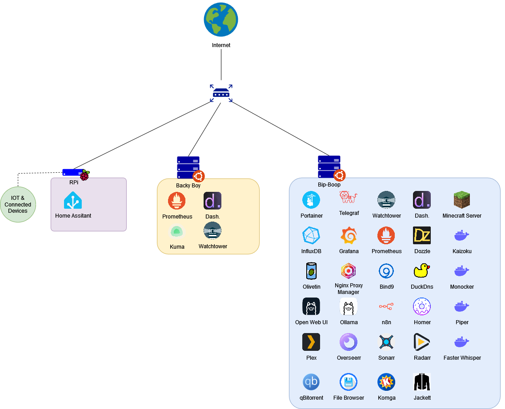

# Home Lab 🧪
## Overview

The primary objective of my home lab is to host various services independently, reducing reliance on cloud services, and fostering continuous learning through experimentation.

## Setup

In my home lab setup, I utilize two main hardware components:

- Raspberry Pi: This device serves as the foundation for my home automation server running Home Assistant. It provides a lightweight and efficient platform for managing smart home devices and automations.

- Powerful Server: For more demanding tasks and services, I have a more robust server equipped with ample storage, considerable RAM, and a dedicated GPU for AI-related workloads. This server runs on Ubuntu Server as the operating system, providing a stable and versatile environment for hosting a wide range of services.

## Virtualization

In my home lab setup, Docker serves as the primary virtualization tool, allowing me to efficiently manage and deploy containerized services. Docker provides a lightweight and portable solution for encapsulating each service into its own container, ensuring consistency and ease of management across different platforms.

Additionally, I utilize Portainer as a Docker management interface, which simplifies the management of my containerized applications. Portainer offers a user-friendly web interface that allows me to monitor, manage, and deploy containers with ease, providing a centralized management solution for my Docker environment.

This combination of Docker and Portainer facilitates the seamless deployment and management of my services within my home lab, enabling efficient resource utilization and streamlined operations.

## Future Expansion

While my current setup meets my immediate needs, I'm continuously exploring opportunities for expansion and improvement. This includes experimenting with new services, optimizing resource allocation, and integrating emerging technologies to enhance the capabilities of my home lab.

## My Services
- **BIND9:** An open-source DNS server.
- **Dashdot:** A dashboard for monitoring my server.
- **Dozzle:** A web interface for viewing Docker logs.
- **DuckDNS:** A free dynamic DNS update service.
- **Faster-Whisper:** A STT service.
- **Filebrowser:** A web-based file manager.
- **Flaresolverr:** A captcha resolver for media streaming.
- **Grafana:** A data analysis and visualization platform.
- **Homer:** A web portal for quick access to your applications and services.
- **InfluxDB:** A time-series database.
- **Jackett:** A torrent tracker aggregator.
- **Kaizoku:** A service like Radarr or Sonarr but for scan.
- **Komga:** A digital manga library.
- **Minecraft Server:** A game server for Minecraft.
- **Monocker:** A Docker container health monitoring & alerting service.
- **n8n:** A workflow automation tool.
- **Nginx-Proxy-Manager:** An Nginx proxy manager for hosting multiple websites on the same server.
- **Olivetin:** Predifined shell commands from web ui.
- **Ollama:** A selfhosted LLM service.
- **Open-WebUI:** A web ui for Ollama.
- **Overseerr:** A request manager for missing media.
- **Piper:** A TTS service.
- **Plex:** A media server for streaming content.
- **Portainer:** A Docker container management interface.
- **Prometheus:** A monitoring and alerting system.
- **QBittorrent:** A BitTorrent client.
- **Radarr:** A movie manager.
- **Sonarr:** A TV series manager.
- **Telegraf:** A data collection agent for InfluxDB.
- **Watchtower:** An automatic update service for Docker containers.

For access to all Docker Compose files, please visit [this folder](link_to_your_folder_containing_docker_compose_files).

Below is a visual representation of the services comprising my homelab setup:

## Networking

In my home lab setup, I have two machines: the Raspberry Pi and my server, each configured with static IP addresses assigned by my router provided by Free. 

A small portion of my services are accessible from the outside world thanks to a reverse proxy setup and DuckDNS. This allows me to conveniently access my services remotely without exposing individual ports.

Additionally, I utilize a local DNS server to provide more user-friendly domain names for my services. This is achieved through a combination of Bind9 for DNS resolution and the reverse proxy for routing traffic based on domain names. This setup enables me to access my services using more intuitive domain names rather than relying solely on IP addresses and ports, which can be cumbersome.

For more details on my local DNS configuration, please refer to [this file](link_to_your_local_dns_config).

Moreover, I am planning to enhance the security of my network by implementing VLANs. Learning and adding VLANs will enable me to segment certain parts of my network, enhancing security by isolating specific devices or services from others. This will provide an additional layer of protection and control over network traffic within my homelab environment.

## Monitoring

In my home lab setup, I employ several tools for monitoring different aspects of my infrastructure:

- **Dashdot:** I use Dashdot for a quick overview of the general resource consumption of my server. It provides a concise summary of system performance metrics.

- **Prometheus/Grafana:** For more detailed metrics and visualization, I utilize the combination of Prometheus and Grafana. Prometheus collects metrics from various sources, while Grafana serves as a powerful visualization tool. This setup allows me to monitor and analyze system performance in greater depth.

- **Telegraf/InfluxDB:** In parallel, I leverage Telegraf to gather custom metrics from my Minecraft server, which are then stored in InfluxDB. Additionally, I capture certain metrics from Home Assistant and store them in the same InfluxDB database. While I currently display only a subset of these data in Grafana, my monitoring setup is designed to evolve over time as I refine and expand my monitoring requirements.

In the near future, I plan to incorporate alerting into my monitoring setup. This will enable me to receive notifications and take proactive actions based on predefined thresholds and conditions, further enhancing the reliability and resilience of my home lab environment.

This multi-layered monitoring approach provides me with both high-level insights and detailed analytics, enabling me to effectively manage and optimize my home lab environment.

## Backup and Recovery

Currently, I am in the process of devising a backup strategy, exploring tools to automate backups in a straightforward manner. The plan, as it stands, includes:

- Backing up the configurations of all my containers.
- Creating backups of all my Docker Compose configurations within Portainer (along with Portainer's own configurations).

Future steps include:

- Duplicating these backups to a local backup server (planned but not yet available).
- Duplicating these backups to the cloud for added redundancy.

By implementing this backup plan, I aim to safeguard against data loss and ensure the resilience of my home lab environment. Stay tuned for further updates as this backup strategy evolves.

## AI Assistance

This documentation was created with the assistance of AI. Through the collaboration with an AI language model, I was able to streamline the process of documenting my home lab setup, ensuring clarity and comprehensiveness in conveying the details of my infrastructure and configurations. This usage of AI technology has facilitated the documentation process, enabling me to focus on refining and enhancing my home lab environment.

