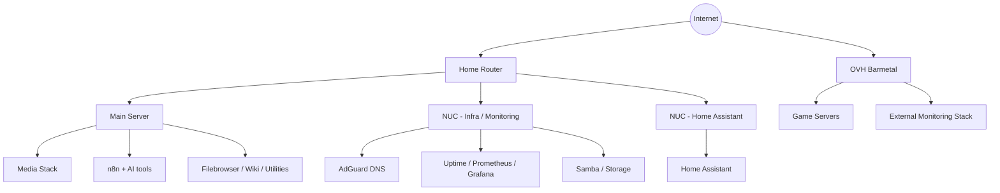

# Home Lab 🧪
## Overview

My homelab has two main purposes:

- Replace cloud services with self-hosted alternatives
- Serve as a playground to experiment and learn

Some services are now part of my daily life and have replaced paid alternatives, while others are still experimental.

Current areas of improvement include:

- Unified authentication (when supported)
- Infrastructure as Code (IaC) and GitOps
- Automated and reliable backups
- More centralized monitoring with alerting

## Setup

My homelab is composed of several machines, each with a specific role:

- **Main Server:**  
  This is still the core of my setup. It handles most of my services, including media, automation, and AI-related workloads.

- **Home Automation NUC:**  
  I migrated my home automation setup (Home Assistant) from a Raspberry Pi to a dedicated NUC for better performance and reliability.

- **Secondary NUC:**  
  Currently underused, but planned to host monitoring, alerting, and backup-related services in order to isolate them from the main server.

- **OVH Server:**  
  A remote server mainly used to host multiplayer game servers, along with a dedicated observability stack.

In addition to this, I have a **4-node ThinkCentre cluster (with a dedicated switch and router)** that is not yet configured.

This cluster is intended as a learning platform to experiment with Kubernetes and cluster management, likely using NixOS in the future.  
A dedicated section will cover this setup once it is operational.

```mermaid
graph TD

Internet((Internet)) --> Router[Home Router]

Router --> MainServer[Main Server]

Router --> NUC1[NUC - Infra / Monitoring]

Router --> NUC2[NUC - Home Assistant]

Internet --> OVH[OVH Barmetal]

MainServer --> Media[Media Stack]
MainServer --> Automation[n8n + AI tools]
MainServer --> Tools[Filebrowser / Wiki / Utilities]

NUC1 --> AdGuard[AdGuard DNS]
NUC1 --> Monitoring[Uptime / Prometheus / Grafana]
NUC1 --> Storage[Samba / Storage]

NUC2 --> HA[Home Assistant]

OVH --> GameServers[Game Servers]
OVH --> Observability[External Monitoring Stack]
```

## Virtualization

I rely on Docker as my primary way to run and manage services across my homelab.  
For now, I stick to a simple and efficient approach using Docker Compose, which fully meets my current needs.

To manage my containers, I use Portainer as a centralized interface. It allows me to monitor and deploy services across multiple machines, including my main server, both NUCs, and my OVH server.

Most of my deployments are handled through Portainer stacks, making it easy to manage and update services without directly interacting with the CLI.

I am currently experimenting with managing my infrastructure using Infrastructure as Code. In particular, I am testing the Portainer Terraform provider to define and manage my stacks programmatically.

In the future, I aim to move toward a more GitOps-oriented workflow, where my infrastructure and services are fully defined and deployed from version-controlled configurations.

While Docker Compose is still my main approach today, I plan to explore Kubernetes on my dedicated cluster as part of my learning journey.

## Future Expansion

While my current setup already covers most of my needs, I’m continuously working on improving and evolving my homelab.

Some of the main areas I want to focus on next include:

- Setting up a more unified authentication system across services
- Moving toward Infrastructure as Code (IaC) and GitOps workflows
- Improving and automating backup strategies
- Building a more centralized monitoring system with proper alerting

I also plan to set up and experiment with a dedicated Kubernetes cluster using my ThinkCentre nodes, mainly as a learning platform.

Overall, the goal is to progressively make the setup more reliable, maintainable, and closer to a production-like environment while keeping room for experimentation.

## My Services

My homelab services are distributed across two main machines: a primary server hosting most applications, and a secondary NUC dedicated to infrastructure, networking, and monitoring.

---

### Main Server (Core Platform)

This machine hosts the majority of my workloads, including media services, automation, AI tools, and user-facing applications.

#### Infrastructure & Access
- Nginx Proxy Manager — reverse proxy and routing layer
- Homer — service dashboard / entry point

#### Observability & Monitoring
- Prometheus — metrics collection (legacy setup, planned migration to NUC)
- Grafana — visualization and dashboards
- InfluxDB — time-series database

#### Media Stack
- Plex — media server
- Overseerr — media request management
- Radarr — movie management
- Sonarr — TV series management
- Prowlarr — indexer manager
- qBittorrent — torrent client
- Komga — digital comics/manga library
- Kamiyomu — manga management tool
- Suwayomi — manga reading backend

#### AI & Automation
- Ollama — local LLM runtime
- Open WebUI — interface for Ollama
- Faster-Whisper — speech-to-text service
- n8n — workflow automation engine

#### File & Knowledge Management
- Filebrowser — web-based file manager
- OtterWiki — personal wiki system
- Vikunja — task and project management

#### Utilities & Operations
- Dozzle — Docker log viewer
- Watchtower — automatic container updates (deployed on all machines)

---

### NUC (Infrastructure Node)

This machine is dedicated to network services, infrastructure components, and lightweight system utilities.

#### Network & Security
- AdGuard Home — DNS-based ad blocking and local DNS resolver

#### Monitoring (Target Architecture)
- Uptime Kuma — uptime monitoring and status pages
- Prometheus — planned migration target for centralized metrics collection

#### Storage & Sharing
- Samba — network file sharing service

#### Maintenance
- Watchtower — automatic container updates (deployed on all machines)

---

### Architecture Notes

- The main server acts as the application and service hub.
- The NUC is progressively becoming the infrastructure and monitoring node.
- Prometheus is currently in a transitional state, with a planned migration toward the NUC for better separation of concerns.
- Watchtower is intentionally deployed on every machine to ensure consistent container updates across the entire homelab.

---

### Design Intent

This architecture is evolving toward:

- clearer separation between applications and infrastructure
- improved resilience of monitoring and network services
- reduced load on the main server for system-level components
- better maintainability through functional isolation

## Networking

My home network is currently based on a simple flat architecture managed by a consumer router (Freebox), with static IP assignments for core devices.

---

### DNS

DNS resolution is primarily handled by AdGuard Home, running on the NUC.

- AdGuard Home is the main DNS resolver for the network
- The router DNS is used as a fallback in case of failure
- DNS filtering and local resolution are centralized in AdGuard Home

This setup provides both ad-blocking capabilities and a centralized way to manage local name resolution.

---

### Internal Access

Internal service access is still mostly IP-based.

- Most services are accessed directly via their static IP addresses
- A more unified service discovery or internal naming system has not yet been implemented, as no current solution fully fits my needs

This approach keeps the setup simple but is less convenient than a fully domain-based internal routing system.

---

### External Access

A limited number of non-critical services are exposed to the internet.

- Exposure is handled through Nginx Proxy Manager
- HTTPS termination is managed at the reverse proxy level
- Public domains are managed via OVH
- Dynamic DNS updates are handled through the router’s built-in DynDNS mechanism

Only services that are not critical are exposed externally, depending on access requirements.

---

### Reverse Proxy

Nginx Proxy Manager acts as the main entry point for HTTP/HTTPS traffic when services are exposed.

- It handles domain-based routing for externally accessible services
- It manages SSL certificates
- It simplifies exposure without direct port forwarding per service

---

### Network Architecture

The current network is a flat architecture:

- No VLAN segmentation is implemented yet
- All devices share the same logical network
- Isolation is handled at the service and application level rather than the network level

---

### Future Improvements

Planned improvements for the network layer include:

- Introduction of VLANs to segment the network (e.g., servers, IoT, clients)
- A more consistent internal service discovery mechanism (DNS-based or alternative solution)
- Improved isolation between devices and services
- Stronger security boundaries between network zones

These improvements are currently in the planning phase and will be introduced progressively as the infrastructure evolves.

## Monitoring

My monitoring setup is currently split across several tools, each covering a specific part of the stack. It is functional but still evolving toward a more unified system.

---

### Metrics Collection

The main metrics system is based on Prometheus, with Grafana used for visualization.

- Prometheus is used for collecting system and service metrics
- Grafana is used to build dashboards and visualize data
- This setup is still evolving, and the final architecture is not fully decided yet
- Prometheus is expected to eventually be centralized on the NUC, but this is not finalized

---

### Time-Series Data

In parallel to Prometheus, I still use a Telegraf + InfluxDB stack.

- Used mainly for Home Assistant metrics
- Also used for Minecraft server metrics when hosted on OVH
- Some newer setups are now moving toward Prometheus exporters instead of Telegraf
- This stack is still maintained for legacy and convenience reasons

---

### Uptime Monitoring

Uptime Kuma is used for service availability monitoring.

- It monitors the availability of selected services
- It is also used for basic status pages
- Some critical services (such as Home Assistant) are actively monitored through it

This is currently the simplest and most reliable part of the monitoring stack.

---

### Disks Monitoring

- Scrutiny was previously used for disk health monitoring
- It is no longer part of the current setup

---

### Dashboards

- Excalidash is currently being tested as a personal dashboard layer
- Grafana remains the main tool for technical dashboards and metrics visualization

---

### Alerting

Alerting is still very limited at the moment.

- Uptime Kuma is used for basic notifications on selected services
- More advanced alerting is not yet implemented
- This is part of the planned improvements for the monitoring stack

---

### Overall Direction

The monitoring stack is currently in a transition phase:

- Prometheus is becoming the main metrics system
- InfluxDB / Telegraf is still used for specific legacy use cases
- Uptime Kuma handles availability monitoring
- The goal is to progressively reduce fragmentation and move toward a more unified observability stack

## Backup and Recovery

Backup and recovery is currently one of the main work-in-progress areas of my homelab. The goal is to progressively move from partial and service-specific backups to a more consistent and centralized strategy.

---

### Current State

At the moment, there is no fully unified backup system across the infrastructure.

- Most services do not yet have automated backups
- Backups are currently limited to specific use cases
- Everything is stored locally only, with no offsite or cloud redundancy

---

### Home Assistant

Home Assistant is currently the only system with a proper backup strategy in place.

- Automated backups run every night
- A retention policy keeps the last 3 backups
- Backups are managed directly through Home Assistant’s built-in system

This is currently the most reliable part of the backup setup.

---

### Planned Backup Scope

The future backup strategy is intended to cover:

- Docker configurations and Compose stacks
- Application data (such as Plex, Komga, and similar services)
- Databases (including InfluxDB and other persistent data stores)

The goal is to ensure that both configuration and data layers can be restored reliably.

---

### Storage Strategy

- All backups are currently stored locally
- No secondary storage or external backup location is implemented yet
- Offsite and cloud backups are planned for future iterations

---

### Future Improvements

Planned evolution of the backup system includes:

- Automated backups for all critical services
- Separation between configuration backups and data backups
- Introduction of a local backup server
- Addition of offsite or cloud redundancy
- Regular restore testing to validate backup integrity

---

### Overall Direction

The backup strategy is currently in an early stage but clearly identified as a priority. The long-term goal is to move toward a reliable, automated, and restorable system covering the entire homelab.olves.

## AI Assistance

This documentation was written with the help of an AI assistant.

I used it to help structure and clarify parts of the content, which made the documentation process faster and easier to manage. It helped me focus more on refining my homelab setup rather than spending too much time on wording and structure.

