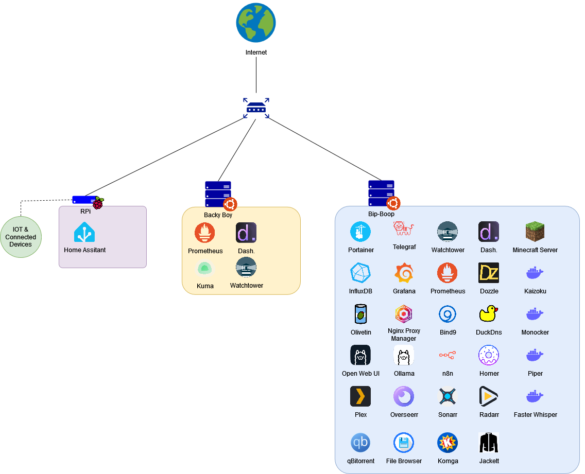

# Home Lab 🧪
## Overview

My homelab has two main purposes:

- Replace cloud services with self-hosted alternatives
- Serve as a playground to experiment and learn

Some services are now part of my daily life and have replaced paid alternatives, while others are still experimental.

Current areas of improvement include:

- Unified authentication (when supported)
- Infrastructure as Code (IaC) and GitOps
- Automated and reliable backups
- More centralized monitoring with alerting

## Setup

My homelab is composed of several machines, each with a specific role:

- **Main Server:**  
  This is still the core of my setup. It handles most of my services, including media, automation, and AI-related workloads.

- **Home Automation NUC:**  
  I migrated my home automation setup (Home Assistant) from a Raspberry Pi to a dedicated NUC for better performance and reliability.

- **Secondary NUC:**  
  Currently underused, but planned to host monitoring, alerting, and backup-related services in order to isolate them from the main server.

- **OVH Server:**  
  A remote server mainly used to host multiplayer game servers, along with a dedicated observability stack.

In addition to this, I have a **4-node ThinkCentre cluster (with a dedicated switch and router)** that is not yet configured.

This cluster is intended as a learning platform to experiment with Kubernetes and cluster management, likely using NixOS in the future.  
A dedicated section will cover this setup once it is operational.

## Virtualization

I rely on Docker as my primary way to run and manage services across my homelab.  
For now, I stick to a simple and efficient approach using Docker Compose, which fully meets my current needs.

To manage my containers, I use Portainer as a centralized interface. It allows me to monitor and deploy services across multiple machines, including my main server, both NUCs, and my OVH server.

Most of my deployments are handled through Portainer stacks, making it easy to manage and update services without directly interacting with the CLI.

I am currently experimenting with managing my infrastructure using Infrastructure as Code. In particular, I am testing the Portainer Terraform provider to define and manage my stacks programmatically.

In the future, I aim to move toward a more GitOps-oriented workflow, where my infrastructure and services are fully defined and deployed from version-controlled configurations.

While Docker Compose is still my main approach today, I plan to explore Kubernetes on my dedicated cluster as part of my learning journey.

## Future Expansion

While my current setup already covers most of my needs, I’m continuously working on improving and evolving my homelab.

Some of the main areas I want to focus on next include:

- Setting up a more unified authentication system across services
- Moving toward Infrastructure as Code (IaC) and GitOps workflows
- Improving and automating backup strategies
- Building a more centralized monitoring system with proper alerting

I also plan to set up and experiment with a dedicated Kubernetes cluster using my ThinkCentre nodes, mainly as a learning platform.

Overall, the goal is to progressively make the setup more reliable, maintainable, and closer to a production-like environment while keeping room for experimentation.

## My Services
- **BIND9:** An open-source DNS server.
- **Dashdot:** A dashboard for monitoring my server.
- **Dozzle:** A web interface for viewing Docker logs.
- **DuckDNS:** A free dynamic DNS update service.
- **Faster-Whisper:** A STT service.
- **Filebrowser:** A web-based file manager.
- **Flaresolverr:** A captcha resolver for media streaming.
- **Grafana:** A data analysis and visualization platform.
- **Homer:** A web portal for quick access to your applications and services.
- **InfluxDB:** A time-series database.
- **Jackett:** A torrent tracker aggregator.
- **Kaizoku:** A service like Radarr or Sonarr but for scan.
- **Komga:** A digital manga library.
- **Minecraft Server:** A game server for Minecraft.
- **Monocker:** A Docker container health monitoring & alerting service.
- **n8n:** A workflow automation tool.
- **Nginx-Proxy-Manager:** An Nginx proxy manager for hosting multiple websites on the same server.
- **Olivetin:** Predifined shell commands from web ui.
- **Ollama:** A selfhosted LLM service.
- **Open-WebUI:** A web ui for Ollama.
- **Overseerr:** A request manager for missing media.
- **Piper:** A TTS service.
- **Plex:** A media server for streaming content.
- **Portainer:** A Docker container management interface.
- **Prometheus:** A monitoring and alerting system.
- **QBittorrent:** A BitTorrent client.
- **Radarr:** A movie manager.
- **RomM:** A tool for managing ROM files.
- **Scrutiny:** A web-based tool for monitoring and analyzing disk health.
- **Sonarr:** A TV series manager.
- **Tautulli:** A monitoring and tracking tool for Plex Media Server.
- **Telegraf:** A data collection agent for InfluxDB.
- **Uptime Kuma:** A monitoring tool focused on uptime monitoring and status page generation.
- **Watchtower:** An automatic update service for Docker containers.

For access to all Docker Compose files, please visit [this folder](link_to_your_folder_containing_docker_compose_files).

Below is a visual representation of the services comprising my homelab setup:

## Networking

In my home lab setup, I have two machines: the Raspberry Pi and my server, each configured with static IP addresses assigned by my router provided by Free. 

A small portion of my services are accessible from the outside world thanks to a reverse proxy setup and DuckDNS. This allows me to conveniently access my services remotely without exposing individual ports.

<!-- Additionally, I utilize a local DNS server to provide more user-friendly domain names for my services. This is achieved through a combination of Bind9 for DNS resolution and the reverse proxy for routing traffic based on domain names. This setup enables me to access my services using more intuitive domain names rather than relying solely on IP addresses and ports, which can be cumbersome.

For more details on my local DNS configuration, please refer to [this file](link_to_your_local_dns_config). -->

Moreover, I am planning to enhance the security of my network by implementing VLANs. Learning and adding VLANs will enable me to segment certain parts of my network, enhancing security by isolating specific devices or services from others. This will provide an additional layer of protection and control over network traffic within my homelab environment.

## Monitoring

In my home lab setup, I employ several tools for monitoring different aspects of my infrastructure:

- **Dashdot:** I use Dashdot for a quick overview of the general resource consumption of my server. It provides a concise summary of system performance metrics.

- **Prometheus/Grafana:** For more detailed metrics and visualization, I utilize the combination of Prometheus and Grafana. Prometheus collects metrics from various sources, while Grafana serves as a powerful visualization tool. This setup allows me to monitor and analyze system performance in greater depth.

- **Telegraf/InfluxDB:** In parallel, I leverage Telegraf to gather custom metrics from my Minecraft server, which are then stored in InfluxDB. Additionally, I capture certain metrics from Home Assistant and store them in the same InfluxDB database. While I currently display only a subset of these data in Grafana, my monitoring setup is designed to evolve over time as I refine and expand my monitoring requirements.
  
- **Uptime Kuma:** Furthermore, I incorporate Uptime Kuma for uptime monitoring and status page generation. This tool helps me track the availability of my services and provides real-time visibility into system health.

- **Scrutiny:** I use Scrutiny to monitor and analyze the health of my disks. It provides detailed information on the status of storage devices, enabling proactive maintenance and prevention of data loss.

In the near future, I plan to incorporate alerting into my monitoring setup. This will enable me to receive notifications and take proactive actions based on predefined thresholds and conditions, further enhancing the reliability and resilience of my home lab environment.

This multi-layered monitoring approach provides me with both high-level insights and detailed analytics, enabling me to effectively manage and optimize my home lab environment.

## Backup and Recovery

Currently, I am in the process of devising a backup strategy, exploring tools to automate backups in a straightforward manner. The plan, as it stands, includes:

- Backing up the configurations of all my containers.
- Creating backups of all my Docker Compose configurations within Portainer (along with Portainer's own configurations).

Future steps include:

- Duplicating these backups to a local backup server (planned but not yet available).
- Duplicating these backups to the cloud for added redundancy.

By implementing this backup plan, I aim to safeguard against data loss and ensure the resilience of my home lab environment. Stay tuned for further updates as this backup strategy evolves.

## AI Assistance

This documentation was created with the assistance of AI. Through the collaboration with an AI language model, I was able to streamline the process of documenting my home lab setup, ensuring clarity and comprehensiveness in conveying the details of my infrastructure and configurations. This usage of AI technology has facilitated the documentation process, enabling me to focus on refining and enhancing my home lab environment.

